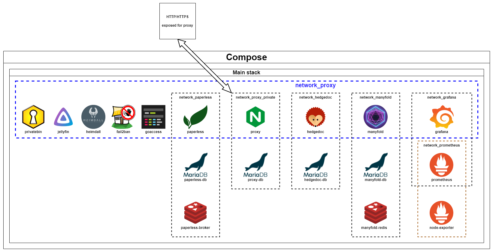
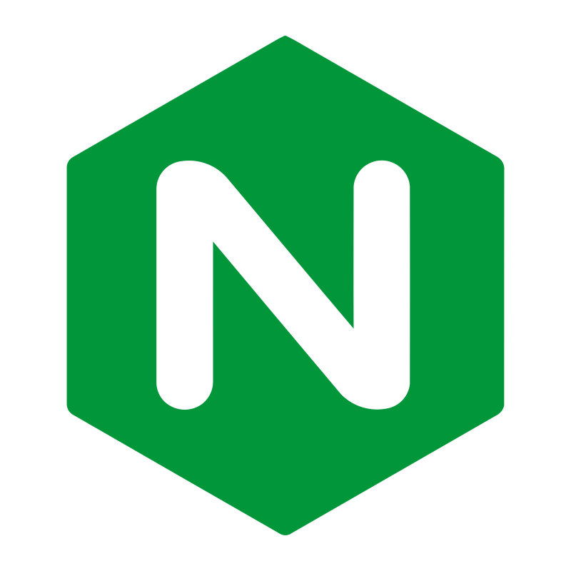

# 🐡🐠🐟🐳🐋🦪🪼🐙🦑🦀🦞🐧🦭🐬🪸🦈
# An entire homelab in one Compose manifest




 

## What am I looking at

A Compose manifest that will :

- [x] Deploy lots of cool services
- [x] Isolate them in virtual networks based on the principle of least privilege
- [x] Automatically handle service dependency
- [x] Run with dedicated users so you don't accidentally give root privileges to your WAN-exposed Jellyfin instance.

## Services included

| Logo | Service Name | Description |
|------|--------------|-------------|
|  | GoAccess | An open-source real-time web log analyzer. |
|  | Grafana | An open-source platform for monitoring and observability. |
|  | HedgeDoc | A platform to create collaborative markdown notes. |
|  | Heimdall | An application dashboard for all your web applications. |
|  | Jellyfin | A free software media system that organizes, manages, and shares digital media. |
|  | Let's Encrypt | A free, automated, and open certificate authority. |
|  | Manyfold | A tool for managing and visualizing data. |
|  | NGINX | A web server that can also be used as a reverse proxy, load balancer, and HTTP cache. |
|  | Paperless | An open-source document management system. |
|  | PrivateBin | A minimalist, open-source online pastebin where the server has zero knowledge of pasted data. |
|  | Prometheus | An open-source monitoring and alerting toolkit. |


## Prerequisites

1. A domain name with the following A records :

```
goaccess 10800 IN A YOUR_SERVER_IP
grafana 10800 IN A YOUR_SERVER_IP
hedgedoc 10800 IN A YOUR_SERVER_IP
home 10800 IN A YOUR_SERVER_IP
jellyfin 10800 IN A YOUR_SERVER_IP
kavita 10800 IN A YOUR_SERVER_IP
manyfold 10800 IN A YOUR_SERVER_IP
paperless 10800 IN A YOUR_SERVER_IP
portainer 10800 IN A YOUR_SERVER_IP
privatebin 10800 IN A YOUR_SERVER_IP
```

2. A fresh install of your favourite distribution on a machine that has ports `80` and `443` exposed to WAN

3. [🐋 Docker](https://www.docker.com/) installed with its [compose](https://docs.docker.com/compose/) plugin

That's it !

## Usage

Clone the repo and create the users and their password.

(clone it where it won't bother - you'll have to keep it to perform maintenance !)

```
$ git clone https://github.com/Chelsea486MHz/compose-homelab
$ bash ./00_create_users.sh
```

You can now manually configure some important informations.

```
$ echo 'DOMAIN="chelsea486mhz.fr"' > .env       # Set to your chosen domain name
$ echo 'INFRA_TIMEZONE="Europe/Paris"' >> .env  # Set to your desired timezone
$ echo 'INFRA_DIR="/mnt/data"' >> .env          # Preferably a dedicated drive
$ echo 'GRAFANA_USERNAME="chelsea"' >> .env      # Choose your own
$ echo 'PAPERLESS_USER="chelsea"' >> .env
$ echo 'GOACCESS_USER="chelsea"' >> .env
```

We can now create the directories the services will use.

```
$ bash ./01_create_directories.sh
```

The next configuration step consists of configuring the subdomains based on the domain you chose.

```
$ bash ./02_subdomains.sh
```

Secrets (that is to say, passwords for default accounts) will have to be generated next.

```
$ bash ./03_create_secrets.sh
```

You can now bring up the entire stack with one magic command !

```
$ docker compose up -d
```

Wait ~10mins for everything to start. You can now access `localhost:81` and configure your reverse proxy with NGINX Proxy Manager !

# 🐡🐠🐟🐳🐋🦪🪼🐙🦑🦀🦞🐧🦭🐬🪸🦈